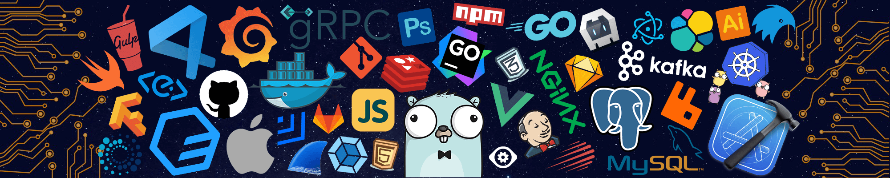

  

  <a href="https://git.io/typing-svg">
    >Hi+👋,+I'm+Piotr;>>AI-Augmented+Full-Stack+Developer;>>Systems+Engineer+&+Linux+Geek;>>Angular+&+%2E+NET+Expert"
      alt="Typing SVG"
    />
  </a>

  <a href="#-about-me">About</a> •
  <a href="#-skills--technologies">Skills</a> •
  <a href="#-featured-projects">Projects</a> •
  <a href="#-github-ecosystem">Stats</a> •
  <a href="#-connect-with-me">Contact</a>

  
  

## 👨‍💻 About Me

  <i>"AI is a force multiplier, not a replacement."</i>

  I am a developer who bridges the gap between <b>traditional engineering</b> and <b>AI-augmented development</b>. I specialize in leveraging LLMs like Gemini, Claude, and Llama to accelerate development cycles and solve complex architectural problems.

  Currently studying <b>Cloud Computing</b> at the Warsaw School of Computer Science, I focus on building applications that aren't just scalable, but also <b>AI-ready</b>. I believe AI is a force multiplier, and I'm dedicated to mastering its integration into modern tech stacks.

---

## 🛠 Skills & Technologies

### 🤖 AI-Augmented Development

### 🏗 Core Stack

### ☁ Infrastructure & DevOps

---

## 🌟 Featured Projects

| Project | Description | Tech Stack | Link |
| :--- | :--- | :--- | :--- |
| **🚀 rpg-companion** | AI-augmented tabletop RPG companion for dynamic storytelling. | Angular, LLM Integration, Gemini 1.5 | [Repo](https://github.com/pmroz1/rpg-companion) |
| **🧠 IsThisCodeHuman** | Research project detecting AI-generated vs human code via LLM analysis. | TypeScript, LLM APIs | [Repo](https://github.com/pmroz1/IsThisCodeHuman) |
| **📝 MdWiki** | A clean, high-performance Markdown-based Wiki application. | Angular, TypeScript | [Repo](https://github.com/pmroz1/MdWiki) |
| **🔐 JWT Decode** | Sleek standalone tool for decoding JSON Web Tokens. | Angular 17+, Signals | [Repo](https://github.com/pmroz1/jwt-decode) |
| **🎲 DnD 5e Creator** | Character creation suite with a focus on UX. | Angular, Tailwind CSS | [Repo](https://github.com/pmroz1/DnD5eCharacterCreator) |

---

## 📊 GitHub Ecosystem

  
  

  
  

  

---

## 📫 Connect With Me

  
  
  

---

  

  📖 Crafted with 💙 by Piotr Mróz | © 2026

